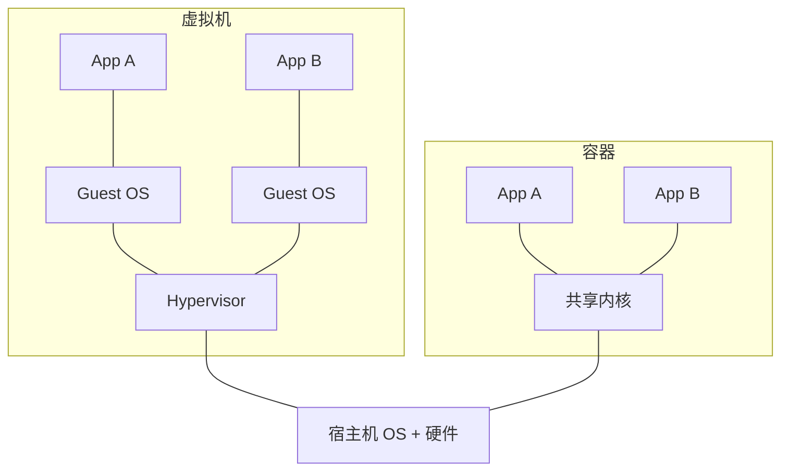
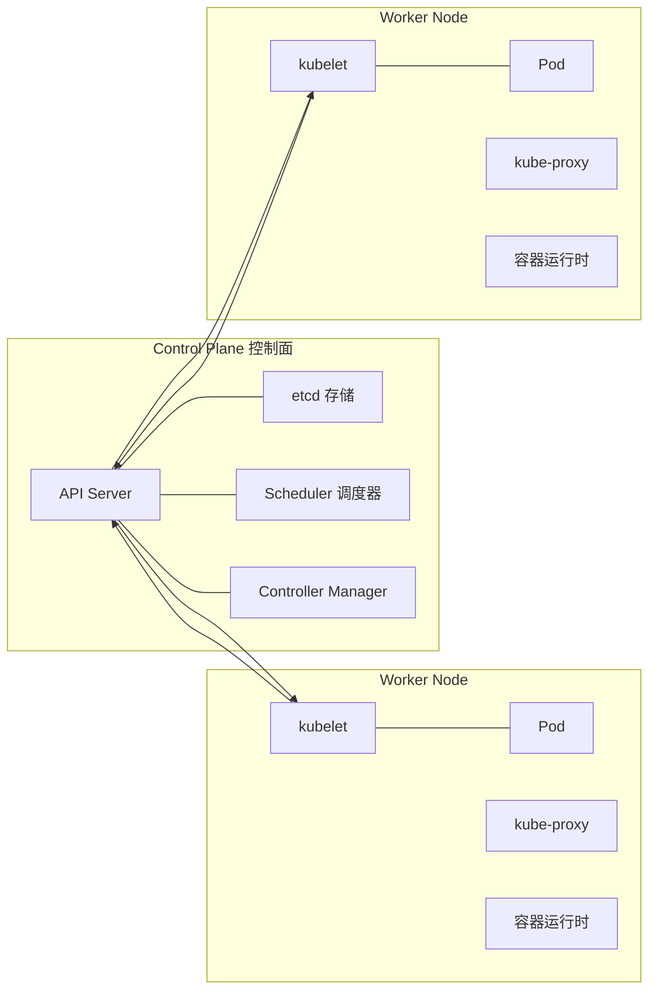

# Docker 与 Kubernetes 部署专题

> 面向高级前端岗位的部署/云原生方向面试准备，结合本仓库 `client/`、`server/`、`docker-compose.yml` 真实代码实操。
> 知识来源：2025–2026 大厂前端面经与云原生面试趋势（见文末「来源」）。

---

## 一、为什么需要 Docker（它解决了什么问题）

Docker 是「操作系统级虚拟化」，通过容器把「代码 + 运行环境」打包成一个可移植单元，核心解决四个问题：

| 问题 | 传统方式痛点 | Docker 方案 |
| --- | --- | --- |
| 环境一致性 | 「我本地能跑，你机器报错」 | 镜像即环境，任何机器行为一致 |
| 部署效率 | 手动装 Node/Nginx、配环境 | 一条命令拉镜像启动 |
| 隔离性 | 多应用互相污染端口/依赖 | 每个容器独立进程、文件、网络命名空间 |
| 资源利用率 | 虚拟机每台要独立 OS，重 | 共享宿主机内核，秒级启动、几十 MB 起 |

**容器 vs 虚拟机（面试高频）**：



- 虚拟机：Hypervisor 虚拟出完整 Guest OS，隔离强但重、启动慢（分钟级）。
- 容器：共享宿主机内核，用 namespace 隔离、cgroups 限资源，轻、启动快（秒级）。

> 面试话术：Docker 部署的好处 = **一致性 + 隔离性 + 可移植 + 自动化**（对应京东/字节面经常见问题「为什么选择 Docker 部署」）。

---

## 二、Docker 核心概念与底层原理

### 1. 三大核心对象

- **镜像 Image**：只读的静态模板，包含运行应用所需的文件系统与启动元数据。
- **容器 Container**：镜像的运行实例，在镜像之上加一层可写层，进程运行在其中。
- **仓库 Registry**：存放与分发镜像的地方，如 Docker Hub、公司私有 Harbor、GHCR。

### 2. 镜像分层（Layer）

Dockerfile 中每条会改变文件系统的指令（`RUN`/`COPY`/`ADD`）都会生成一个只读层，底层用 **OverlayFS/UnionFS** 联合挂载：

```text
容器可写层（Container layer，随容器删除而消失）
─────────────────────────────
Layer N  COPY dist ./
Layer N-1 RUN pnpm build
Layer N-2 COPY package.json pnpm-lock.yaml ./
Layer N-3 RUN pnpm install
Layer 1  FROM node:22-alpine
```

分层的意义：**层可复用、可缓存、可共享**。多个镜像共享相同底层（如都基于 `node:22-alpine`），只占用一份存储；构建时没变的层直接用缓存，加速构建。

### 3. 底层原理：namespace + cgroups（字节面经原题）

Docker 的「隔离」和「限额」分别来自 Linux 内核两个机制：

- **namespace（命名空间）——隔离**：让每个容器拥有独立的进程、网络、挂载等视角。
  - PID：进程隔离
  - NET：网络隔离（独立网卡、IP）
  - IPC：进程间通信隔离
  - MNT：文件系统挂载点隔离
  - UTS：主机名/域名隔离
  - USER：用户隔离
- **cgroups（控制组）——限额**：限制与统计容器可用的 CPU、内存、磁盘 I/O、网络带宽，防止某个容器吃光宿主机资源。

> 一句话总结：**namespace 负责“看起来是独立的”，cgroups 负责“不能无限制地用”**。

### 4. Docker 网络模式

| 模式 | 说明 | 典型场景 |
| --- | --- | --- |
| bridge | 默认，容器接虚拟网桥，通过端口映射 `-p` 对外 | 单机多容器 |
| host | 与宿主机共享网络栈，性能好但端口易冲突 | 高性能场景 |
| none | 完全隔离无网络 | 特殊隔离需求 |

### 5. Docker 数据持久化

容器可写层随容器删除而消失，持久化用 **Volume（数据卷）** 挂载到宿主机目录，常用于数据库、日志、上传文件。

---

## 三、Dockerfile 详解与优化

### 1. 常用指令（面试常问）

| 指令 | 作用 |
| --- | --- |
| `FROM` | 指定基础镜像，一个 Dockerfile 可有多个（多阶段） |
| `WORKDIR` | 设置工作目录，后续指令基于它执行 |
| `COPY` | 复制本地文件/目录到镜像 |
| `ADD` | 类似 COPY，额外支持自动解压 tar、远程 URL |
| `RUN` | 构建时执行命令（安装依赖、编译） |
| `CMD` | 容器启动时的默认命令，可被 `docker run` 覆盖 |
| `ENTRYPOINT` | 固定入口命令，`CMD` 作为其默认参数 |
| `ENV` / `ARG` | 环境变量 / 构建参数（ARG 仅构建期可用） |
| `EXPOSE` | 声明容器监听端口（文档性质，不真正发布端口） |

### 2. 高频辨析

**ADD vs COPY（面经原题）**：
- `COPY`：纯复制，行为可预期，**官方推荐**。
- `ADD`：额外支持「自动解压 tar 包」「从远程 URL 下载」，但会引入副作用（不可预期的解压、构建期依赖网络）。
- 结论：**能用 COPY 就用 COPY**，除非明确需要解压 tar。

**CMD vs ENTRYPOINT**：
- `CMD`：默认命令，`docker run <image> 其他命令` 会整体替换它。
- `ENTRYPOINT`：容器启动固定执行的程序，`docker run` 后跟的参数会作为参数传给 ENTRYPOINT。
- 组合用法：`ENTRYPOINT ["nginx"]` + `CMD ["-g","daemon off;"]`，用户 `docker run xxx -v` 可追加参数而不丢主程序。

### 3. 多阶段构建（前端部署标准答案）

一次构建、多个 `FROM`，把「构建环境」和「运行环境」分离，最终镜像只保留运行所需产物：

```dockerfile
# Stage 1: 构建
FROM node:22-alpine AS builder
WORKDIR /app
RUN corepack enable && corepack prepare pnpm@latest --activate
COPY package.json pnpm-lock.yaml ./
RUN pnpm install --frozen-lockfile
COPY . .
RUN pnpm build

# Stage 2: 运行
FROM nginx:alpine
COPY --from=builder /app/dist /usr/share/nginx/html
COPY nginx.conf /etc/nginx/conf.d/default.conf
EXPOSE 80
CMD ["nginx", "-g", "daemon off;"]
```

优势（面试鸭标准答案）：
1. **减小最终镜像体积**：丢弃 node_modules、源码、构建工具，只剩 Nginx + 静态产物。
2. **分离构建与运行环境**：运行环境不暴露编译链，更安全。
3. **提高构建效率与安全性**：层缓存可复用，攻击面更小。

### 4. 优化策略（结合本仓库代码）

本仓库 [`client/Dockerfile`](../client/Dockerfile) 和 [`server/Dockerfile`](../server/Dockerfile) 已经是多阶段构建，逐条拆解：

```dockerfile
# 先只 COPY 依赖清单再 install，而不是 COPY 整个项目
COPY package.json pnpm-lock.yaml ./
RUN pnpm install --frozen-lockfile
COPY . .
```

为什么这么写：**最大化利用层缓存**。源码经常改，但依赖清单变化少；若先 `COPY . .` 再 `install`，任何源码改动都会让依赖层缓存失效、重新安装。先拷清单、后拷源码，依赖层可在源码不变时复用。

进一步优化点：
- `.dockerignore` 排除 `node_modules`、`dist`、`.git`，避免污染构建上下文。
- 优先 Alpine 系镜像（体积小）。
- server 生产阶段用 `pnpm install --prod` 只装生产依赖。
- 多阶段产物用 `COPY --from=builder` 精确复制。

---

## 四、Docker Compose 编排

本仓库 [`docker-compose.yml`](../docker-compose.yml)：

```yaml
services:
  server:
    build: ./server
    ports:
      - "3000:3000"
    restart: unless-stopped

  client:
    build: ./client
    ports:
      - "80:80"
    depends_on:
      - server
    restart: unless-stopped
```

要点：
- `build`：从目录内 Dockerfile 构建镜像。
- `ports`：`宿主端口:容器端口`。
- `depends_on`：定义启动顺序，但**只保证“先启动”不保证“已就绪”**；真正健康依赖要用 `healthcheck` + `condition: service_healthy`。
- `restart: unless-stopped`：容器异常退出自动拉起，除非手动停止。

---

## 五、Kubernetes 核心架构

### 1. 整体架构



- **Control Plane（控制面）**：集群大脑。
  - `API Server`：唯一入口，所有操作经它写入 etcd。
  - `etcd`：分布式 KV 存储，保存集群所有状态。
  - `Scheduler`：决定 Pod 调度到哪个 Node。
  - `Controller Manager`：维护期望状态与实际状态一致（如副本数不足则补）。
- **Worker Node（工作节点）**：
  - `kubelet`：节点上“管家”，向 API Server 上报状态、按调度结果拉起容器。
  - `kube-proxy`：实现 Service 到 Pod 的流量转发（iptables/IPVS）。
  - 容器运行时：containerd 等。

### 2. 核心对象

| 对象 | 作用 |
| --- | --- |
| Pod | **最小调度单元**，一个 Pod 可含 1+ 共享网络/存储的容器 |
| Deployment | 管理无状态应用的副本数、滚动更新、回滚 |
| Service | 为 Pod 提供稳定访问入口（ClusterIP/NodePort/LoadBalancer） |
| ConfigMap / Secret | 配置 / 敏感信息（密钥、token）注入 |
| Ingress | 七层路由，把域名/路径映射到 Service |

### 3. Pod 生命周期与健康检查

三个探针（Probe）：
- `livenessProbe`：存活探针，失败则**重启容器**。
- `readinessProbe`：就绪探针，失败则**摘除流量**（不重启），直到恢复再接入。
- `startupProbe`：启动探针，保护启动慢的应用，避免被 liveness 误杀。

### 4. 网络：Pod 间如何通信（面经原题）

K8s 网络模型核心约定：**每个 Pod 拥有独立 IP，Pod 间无需 NAT 可直接通信**。跨节点通信通常由 CNI 插件（Flannel/Calico）实现；Service 抽象则解决「Pod 会重建、IP 会变」的问题——通过标签选择器把一组 Pod 绑定到稳定 ClusterIP，`kube-proxy` 维护转发规则（iptables/IPVS），把到 Service 的流量负载均衡到后端 Pod。

### 5. 资源管理与弹性伸缩

- `requests`：Pod 声明需要的最小资源，**Scheduler 据此调度**。
- `limits`：Pod 能使用的上限，超限 CPU 被节流、内存可能 OOMKilled。
- **HPA（Horizontal Pod Autoscaler）**：根据 CPU/内存或自定义指标自动增减副本数。

> 云原生面试常见场景题「如何优化集群节点利用率」的答案骨架：合理设置 requests/limits → 避免过度预留 → 用 HPA 动态伸缩 → 搭配 cluster-autoscaler 按需扩节点。

---

## 六、前端应用 K8s 部署实战（结合本项目）

以 `server`（NestJS API）为例的完整清单：

```yaml
apiVersion: apps/v1
kind: Deployment
metadata:
  name: server
spec:
  replicas: 2
  selector:
    matchLabels:
      app: server
  template:
    metadata:
      labels:
        app: server
    spec:
      containers:
        - name: server
          image: server:latest
          ports:
            - containerPort: 3000
          resources:
            requests:
              cpu: 100m
              memory: 128Mi
            limits:
              cpu: 500m
              memory: 512Mi
          readinessProbe:
            httpGet:
              path: /api/health
              port: 3000
            initialDelaySeconds: 5
            periodSeconds: 10
          livenessProbe:
            httpGet:
              path: /api/health
              port: 3000
            initialDelaySeconds: 15
            periodSeconds: 20
---
apiVersion: v1
kind: Service
metadata:
  name: server
spec:
  selector:
    app: server
  ports:
    - port: 3000
      targetPort: 3000
  type: ClusterIP
```

前端 `client`（Nginx 静态资源）类似，`readinessProbe` 探 `/`；`Ingress` 按路径路由：

```yaml
apiVersion: networking.k8s.io/v1
kind: Ingress
metadata:
  name: app
spec:
  rules:
    - host: app.example.com
      http:
        paths:
          - path: /api
            pathType: Prefix
            backend:
              service:
                name: server
                port:
                  number: 3000
          - path: /
            pathType: Prefix
            backend:
              service:
                name: client
                port:
                  number: 80
```

> 注：以上清单需在已装好的 K8s 集群（如本地 Minikube/Kind）中配合镜像推送后运行，属示意性质。

滚动更新与回滚：修改 Deployment 镜像 tag 后 `kubectl apply` 触发滚动更新；`kubectl rollout undo deployment/server` 回滚。

---

## 七、CI/CD 与 GitOps

- **CI/CD**：代码提交 → 构建镜像 → 推送到 Registry → 部署（GitHub Actions/GitLab CI 是常见载体）。
- **分支/PR 环境（Ephemeral Environment）**：为每个分支/PR 拉起独立环境，用容器标签 + 分支名映射子域名，实现「一条 PR 一个可预览环境」。
- **GitOps（ArgoCD/Flux）**：以 Git 仓库为唯一事实来源，声明式清单变更自动同步到集群，实现可审计、可回滚的持续部署。

---

## 八、面试高频考点速查

1. **Docker 部署有什么好处？** → 一致性、隔离、可移植、自动化。
2. **Docker 底层原理？** → namespace（隔离）+ cgroups（限额）+ 联合文件系统（分层）。
3. **ADD 和 COPY 的区别？** → COPY 纯复制推荐；ADD 额外解压 tar/远程下载，有副作用。
4. **Dockerfile 常用命令？** → 见上文表格。
5. **如何减小镜像体积？** → 多阶段构建、Alpine、.dockerignore、按需安装依赖。
6. **K8s 架构？** → Control Plane（API Server/etcd/Scheduler/Controller Manager）+ Worker Node（kubelet/kube-proxy/运行时）。
7. **Pod 之间如何通信？** → 每 Pod 独立 IP，跨节点靠 CNI；Service + kube-proxy 提供稳定入口与负载均衡。
8. **liveness 与 readiness 区别？** → 前者失败重启，后者失败摘流量。
9. **requests 和 limits 区别？** → requests 用于调度，limits 是使用上限。
10. **Node 如何利用服务器多核？** → Node 单线程，可用 `cluster`/`worker_threads`，或 K8s 多副本 + 合理 requests/limits 让调度器分散到多核/多节点。

---

## 来源

- 字节前端面经（docker 好处、namespace/cgroups、node 多核）：https://www.nowcoder.com/discuss/353156391919624192
- 京东面经（选择 docker 原因、k8s 了解）：https://www.nowcoder.com/feed/main/detail/209043d85e7e4e9a8286a792460c9a41
- 云原生面试指南（镜像分层/多阶段、Pod 生命周期/健康检查）：https://developer.baidu.com/article/detail.html?id=3817744
- 面试鸭：如何使用 Docker 部署前端项目（多阶段构建优势）：https://www.mianshiya.com/question/1831172725134077954
- 字节：前端分支环境部署思路（容器 + docker-compose/k8s + 标签域名）：https://mp.weixin.qq.com/s/BwJN7UHyCF2JSkthRpibQQ
