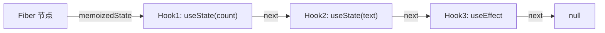

# React 核心机制

> 你的简历写了"兼具 React 项目能力"，面试官大概率会问。不需要面面俱到，但核心机制要能说清楚。

---

## 一、Fiber 架构

> **Fiber 架构四大核心（总览）：**
>
> 1. **任务分解**：每个组件对应一个 Fiber 节点（工作单元），保存 `type/props/stateNode` 等信息，用 `child/sibling/return` 三个指针串成可中断的树；
> 2. **双缓存 + diff**：新的 React 元素树和旧的 current 树对比，生成 workInProgress 树并打 flags，commit 阶段最小化更新 DOM；
> 3. **优先级调度**：每个更新带 lane 优先级，高优先级可插队，配合时间切片实现暂停/恢复/重排；
> 4. **状态保存**：Fiber 的 `memoizedState` 保存 hook 链表，让 Hooks 状态跨 render 持久。
>
> ⚠️ 术语纠正：React 不是「增量渲染」，而是「全量重新 render + 最小 diff」；优先级是「更新的 lane」，不是「节点之间的对比」。

### 1.1 为什么需要 Fiber？

React 15 的 Stack Reconciler 是同步递归的——一旦开始 diff 就不能中断，主线程被长时间占用会导致掉帧。

```
问题场景：
一个包含 3000 个节点的组件更新
  → Stack Reconciler：同步遍历 3000 个节点
  → 主线程被占用 100ms+
  → 掉帧、用户点击无响应

Fiber 的解决思路：
  → 将 diff 拆分为可中断的小任务
  → 每个任务执行完检查是否有更高优先级的工作
  → 有则让出主线程，闲时再继续
```

### 1.2 Fiber 节点的数据结构

```js
// Fiber 节点核心字段
{
  // 静态属性（描述节点本身）
  type: 'div',          // 组件类型
  key: null,            // key
  props: {...},         // 属性
  stateNode: domNode,   // 对应的真实 DOM

  // 链表属性（构建 Fiber 树）
  return: parentFiber,  // 父节点
  child: firstChild,    // 第一个子节点
  sibling: nextSibling, // 下一个兄弟节点

  // 工作相关
  alternate: oldFiber,  // 指向旧 Fiber（双缓冲）
  effectTag: 'UPDATE',  // 副作用标记（增/删/改）
  lanes: 0,             // 优先级
}
```

### 1.3 双缓冲机制（Double Buffering）

```
React 同时维护两棵 Fiber 树：
  current tree   → 当前屏幕上显示的（通过 alternate 指向 workInProgress）
  workInProgress → 正在内存中构建的新树

Commit 阶段完成后：
  workInProgress → 变成新的 current tree
  root.current = finishedWork  // 切换指针
```

**好处：** 内存中构建新树完成后一次性替换，保证视觉一致性；构建过程中旧树不受影响。

**核心精髓：复用，而不是重建。**

workInProgress 树不是从零重新生成，而是**复用 current 树中未变化的 Fiber 节点**，只有需要更新的部分才克隆出新节点，通过 `alternate` 和 current 互相关联。这样省内存、省 GC。

**render 阶段的 diff 与标记是同一件事：**

遍历的过程就是 diff/reconcile，diff 的结果就是打上 `flags`（副作用标记），不是「先标记再 diff」两个先后步骤。

**精修版总结：**

> 双缓存是 Fiber 的核心：React 同时维护 current 树（屏幕显示）和 workInProgress 树（内存构建）。更新时复用 current 中未变化的节点、克隆变化的部分，边遍历边 diff、边打 flags 和优先级；commit 完成后把 root.current 指针切换到新 workInProgress。核心价值是「复用节点 + 指针切换」，而不是重建整棵树。

### 1.4 工作循环（Work Loop）

```
render 阶段（可中断）：
  while (workInProgress !== null && !shouldYield()) {
    workInProgress = performUnitOfWork(workInProgress)
    // 深度优先遍历 Fiber 树
    // shouldYield() 检查是否需要让出主线程
  }

commit 阶段（不可中断）：
  1. beforeMutation  (getSnapshotBeforeUpdate)
  2. mutation        (DOM 更新)
  3. layout          (useLayoutEffect)
```

### 1.5 一次更新的完整流程（从 setState 到屏幕更新）

> 总纲：React 核心 = `UI = f(state)`（数据驱动视图）。Fiber 四大核心：任务分解、双缓存 + diff、优先级调度、状态保存。

```
① 触发：setState / dispatch 创建 update，追加到 hook.queue.pending
        （此时 state 没变，只是入队）

② 调度：Scheduler 根据 update.lane 分配优先级，决定何时渲染

③ render 阶段（可中断）：
   - 遍历构建 workInProgress 树
   - processUpdateQueue：执行 queue 里的 update，算出新 state，写回 hook.memoizedState
   - 组件函数重新执行（拿到新 state）
   - diff：对比新旧，打上 flags（增/删/改标记）

④ commit 阶段（不可中断）：
   根据 flags 一次性操作真实 DOM

⑤ 切换 current 指针，渲染完成
```

**关键顺序（易错）：**「执行队列拿最新 state」（processUpdateQueue）在 **render 阶段**，和 diff 打 flag 是同一阶段；commit 只照着 flag 改真实 DOM，不再算 state。优先级 lane 在 update 创建时已定，不是 render 阶段打的。

**易错补充：**

- ❌ 说成「compiler」——render 之后是 **commit**，不是 compiler（compiler 是 React 编译器，构建期自动记忆化）；
- ❌ 说「每个 fiber 的 hooks pending 队列都会计算」——只有**有更新的组件**才 processUpdateQueue，bailout 的不处理；
- ❌ 说「scheduler 打优先级」——lane 在 update 创建时已定，scheduler 只是根据 lane 调度。

### 1.6 渲染边界：lane 冒泡 + bailout

**render 的起点是根（HostRoot），不是触发组件。** setState 触发后：

1. `markUpdateLaneFromFiberToRoot`：给触发 Fiber 标记 lane，沿 `return` 向上冒泡，给所有祖先标记 `childLanes`，直到根；
2. render 从 HostRoot 开始深度优先遍历；
3. 遍历到每个节点检查：自身 `lanes` 为空且 `childLanes` 为空 → **bailout**，跳过整棵子树（不执行组件函数，复用旧 Fiber 和 DOM）；
4. 触发组件 `lanes` 有更新 → 重新执行组件函数；
5. 子组件：默认函数组件做「引用相等」比较（几乎总是重渲染），用 `React.memo` 才做浅比较、没变才 bailout。

```
Root ──► App ──► B ──► C（触发点）
  ↑        ↑      ↑      ↑
childLanes 被标记（子树有更新）

遍历时：Root/App/B 自身 lanes 空但 childLanes 有 → 路过不重渲染
        C lanes 有 → 重新执行
        C 的子组件 → props 没变 bailout，变了重渲染
```

**面试话术：** setState 触发后，React 标记该 Fiber 的 lane，并沿 return 向上冒泡标记祖先 childLanes，然后从根深度优先遍历；lanes 和 childLanes 都为空就 bailout 跳过子树。所以祖先只是路过不重渲染，真正重渲染的是触发组件本身和 props 变化的子组件——这是靠「lane 冒泡 + bailout」实现的精准渲染边界，不是「只看触发组件」。

---

### 1.7 memo 的 bailout 边界（模拟面试 #9 盲区补录，2026-08-26）

> 来源：2026-08-26 React 专场模拟面试第三题（Parent/Child/MemoChild 打印次数题）。
> 暴露问题：打印次数账本糊、memo 机制说不出、bailout 边界不清。以下为精确答案。

**渲染账本（必须形成条件反射）：**

```jsx
// Parent 内含 <Child /> 和 <MemoChild />（React.memo 包裹），点击按钮 3 次
Parent render:   4 次（初始挂载 1 + setState 3）
Child render:    4 次（父渲染 → 子无条件重渲染，与 props 无关）
MemoChild render: 1 次（仅初始挂载，之后 props 浅比较通过 → bailout，函数体不执行）
```

**memo bailout 四边界（挡得住 / 挡不住）：**

| 场景 | 挡得住吗 | 原因 |
| --- | --- | --- |
| 父渲染 + props 浅比较通过 | ✅ | memo 的本职：逐个 `Object.is`，全等则跳过 render |
| 父渲染 + props 浅比较失败 | ❌ | 内联函数/对象字面量每次引用都新，比较必假，memo 形同虚设 |
| 自身 state 变化 | ❌ | memo 只拦 props 通道，管不了组件自己的 setState |
| Context 变化 | ❌ | Context 值查找发生在渲染期、不走 props 通道，直接穿透 memo |

第三行是「memo 必须配 useMemo/useCallback」的根本原因，也是 React Compiler 存在的动机（自动保证引用稳定）。

**⚠️ 精确性纠正（本轮实际口误）：**

- 「闭包里的 state 是上一次渲染的快照」→ **不准确**。是 **effect 执行那一刻那次渲染的快照**，之后组件重渲染一百次，只要依赖不变、effect 不重跑，这个闭包里的值一个字都不变。
- 闭包陷阱症状：不是「并发消息才丢数据」，是**无论何时**新数据都基于过期快照展开——聊天室例子里列表永远只显示最后一条。
- startTransition 里包裹的是 **state 更新**（`startTransition(() => setX(v))`），不是异步请求。React 调度的是渲染，不是 IO；异步数据接入渲染优先级的正路是 React 19 的 `use(promise)` + Suspense。

**effect 对称性原则（setup/cleanup 幂等可重放）：**

- setup 做了什么，cleanup 必须完整撤销什么——让 React 可以随时销毁重跑 effect 而不留副作用残留。
- StrictMode 双执行（mount → unmount → remount）就是在测这条 invariant。
- 全局单例约束下，监听器清理必须用具名引用：`const handler = ...; socket.on('message', handler); return () => socket.off('message', handler);`——匿名函数 off 不掉。
- 依赖数组权衡：漏依赖 → 闭包过期（数据覆盖）；全依赖 → effect 风暴（反复断连重连）。函数式更新 `setX(prev => ...)` 不读旧 state，直接绕开整个权衡。

---

## 二、Hooks 原理

### 2.1 Hooks 的存储结构

**核心心智模型：状态不在函数里，而在 Fiber 上。**

函数组件每次 render 都是重新执行一遍函数，但状态能「记住」，是因为状态不存函数作用域里，而是存在组件对应的 **Fiber 节点的 `memoizedState` 单向链表**上。



```js
// 每个 Fiber 节点维护一个 hooks 链表
fiber.memoizedState → hook1 → hook2 → hook3 → null

// 每个 hook 的数据结构
{
  memoizedState: currentValue,  // 当前值
  queue: {                      // 更新队列
    pending: update1 → update2 → ...
  },
  next: nextHook,               // 链表指针
}
```

**Hook 节点的真实字段：**

```js
{
  memoizedState: null,  // useState：当前值；useEffect：effect 对象；useMemo：[值, deps]
  baseState: null,      // 计算 state 的基准
  baseQueue: null,      // 基准更新队列（优先级相关）
  queue: null,          // 更新队列（useState 用）
  next: null,           // 指向下一个 Hook
}
```

**注意两个 memoizedState 是两回事：**

- `Fiber.memoizedState`：指向 Hook 链表头；
- `Hook.memoizedState`：存这个 Hook 自己的状态值。

**queue 和 update 的结构：**

```js
// Hook.queue
{
  pending: null,                    // 待处理的 update 循环链表（环形）
  dispatch: null,                   // setState 函数
  lastRenderedReducer: reducer,     // 计算 state 用的 reducer
  lastRenderedState: initialState,  // 上次渲染的 state
}

// 每个 update（一次 setState 产生一个）
{
  lane: lane,       // 优先级
  action: action,   // 值 或 函数（prev => ...）
  next: null,       // 循环链表指针
}
```

**层级总览：**

```
Fiber.memoizedState → Hook1 →next→ Hook2 →next→ Hook3 → null
                       ├─ memoizedState：状态值
                       └─ queue → pending → update 循环链表
```

**为什么要按顺序调用？**

render 时 React 是「按调用顺序」遍历这条链表的：

- 第 1 次调用 `useState` → 取链表第 1 个节点；
- 第 2 次调用 `useState` → 取链表第 2 个节点；
- ...

一旦用 `if` / 循环在某次 render 跳过某个 Hook，调用顺序就变了，后面的 Hook 会取错节点，状态全部错位。所以 Hooks 必须写在顶层，不能条件调用。

**「取错节点」的「节点」指什么？**

指的是 **Hook 链表上的 Hook 节点**——每个 Hook 对应一个节点，里面存 `memoizedState`（状态值）、`queue`、`next`。React 用一个「当前指针」按**调用顺序**遍历链表，只看「第几次调用」，不看 Hook 内容。

```tsx
function Component() {
  const [a] = useState('A')   // 第 1 次调用

  if (someCondition) {
    const [b] = useState('B') // 第 2 次调用（仅条件成立时）
  }

  const [c] = useState('C')   // 第 3 次调用
}
```

- 首次 render（条件成立）：创建 `节点1(A) → 节点2(B) → 节点3(C)`；
- 第二次 render（条件不成立，跳过 `useState('B')`）：第 2 次调用 `useState('C')` 会去取**链表第 2 个节点**（存的是 B），导致 `c` 拿到 `'B'` 而不是 `'C'`，状态错位。

**对照 Vue：**

| Vue | React Hooks |
| --- | --- |
| 响应式依赖收集（track/trigger） | Hook 链表 + 调用顺序 |
| `ref` 值存在 Dep/RefImpl | `useState` 值存在 `hook.memoizedState` |
| 依赖变化自动触发更新 | `setState` 推进 queue，触发 re-render |

Vue 是「数据变了我自己去通知」；React 是「状态变了重新执行函数，按顺序从链表取状态」。

### 2.2 useState 源码级原理

```js
function useState(initialState) {
  const hook = mountWorkInProgressHook() // 创建/获取 hook 节点

  // 惰性初始化
  if (typeof initialState === 'function') {
    initialState = initialState()
  }

  // 首次渲染挂载初始值
  if (hook.memoizedState === undefined) {
    hook.memoizedState = initialState
  }

  // 计算新状态
  const newState = processUpdateQueue(hook.queue)
  if (newState !== undefined) {
    hook.memoizedState = newState
  }

  const dispatch = (action) => {
    // 创建 update 对象，加入 queue
    const update = {
      action,
      next: null,
      lane: requestUpdateLane()
    }
    enqueueUpdate(hook.queue, update)
    // 触发重新渲染
    scheduleUpdateOnFiber(fiber, lane)
  }

  return [hook.memoizedState, dispatch]
}
```

**setState 与 render 的流转：**

```
setCount(action)
  → 创建 update { action, lane, next }
  → 加入 queue.pending（环形链表）
  → 触发调度，标记 fiber 需要更新
  （此时不碰 hook.memoizedState，值没变）

下次 render（processUpdateQueue）：
  → 从 baseState / memoizedState 作为起点
  → 遍历 queue.pending 的 update，逐个执行 action
      action 是函数 → action(state)
      action 是值   → 直接作为新 state
  → 得到最终 state，写回 hook.memoizedState
```

**useState 底层是 useReducer 的特例：**

```js
function basicStateReducer(state, action) {
  return typeof action === 'function' ? action(state) : action
}
// useState(0) 等价于 useReducer(basicStateReducer, 0)
```

这也是 useReducer 和 useState 共用同一套存储结构（memoizedState + queue）的原因。

**setState 传相同值会跳过更新吗？（eagerState 优化 + bailout）**

会，但主要不是 diff 识别，而是两层机制：

1. **dispatch 阶段 eagerState 优化**：当 hook 的 queue 为空时，React 提前算出新值，用 `Object.is` 和当前 `memoizedState` 比较，相同则直接 return，**连调度都不触发、不进 render**；
2. **render 阶段 bailout**：如果因别的更新进入 render，diff 时对「props 浅比较相同且无 pending lane」的子组件直接复用旧 Fiber 和 DOM，跳过子树（`React.memo` 就是开这个开关）。

**Object.is 只比引用，注意边界：**

```
setCount(0)            → 相同，跳过 ✅
setCount(prev => prev) → 返回相同值，跳过 ✅
setCount({})           → 两次 {} 引用不同，不跳过 ❌
```

**面试话术：** setState 传相同值能跳过，但主要在 dispatch 阶段的 eagerState 优化（队列空时提前求值 + Object.is 比较），已进入 render 则靠 bailout 跳过没变的子树。注意 Object.is 只比引用。

### 2.2.1 追问：setState 的 updater 很复杂会阻塞渲染吗？

**结论：会，但根因是「长任务占主线程」，不是 setState 本身。**

setState 的 updater 函数、组件 render 都跑在主线程上。复杂计算一旦超过一帧 16ms，浏览器就来不及绘制，表现为掉帧、交互卡顿。

**同步更新 vs 并发更新（关键区分）：**

| 更新方式 | 能否中断 | 结果 |
| --- | --- | --- |
| 普通 `setState` | ❌ 不可中断 | 复杂 render 一路跑到 commit，阻塞主线程 |
| `useTransition` / `useDeferredValue` | ✅ 可中断 | 时间切片，让输入、动画等紧急更新插队 |

```jsx
// ❌ 普通更新：复杂 render 会卡住主线程
setData(complexData)

// ✅ 标记为非紧急：React 切片，紧急更新优先
const [isPending, startTransition] = useTransition()
startTransition(() => setData(complexData))
```

**解决方案分层：**

1. 复杂计算提前算好，或用 `useMemo` 缓存；
2. 真正重的计算丢到 Web Worker，不占主线程；
3. 低优先级更新用 `useTransition` / `useDeferredValue`，享受可中断 + 时间切片；
4. 渲染节点太多用虚拟滚动减少实际渲染量。

**面试话术：** render 和 updater 都在主线程执行，复杂计算产生长任务会掉帧。用 useMemo 提前算、重计算放 Web Worker、不紧急更新用 useTransition 标记让 React 可中断切片。注意普通 setState 是同步不可中断的，只有并发更新才享受时间切片。

### 2.3 useEffect vs useLayoutEffect

```
useEffect:
  执行时机：render → commit(DOM更新) → 浏览器绘制 → useEffect
  用途：数据请求、订阅、手动 DOM 操作（不阻塞渲染）
  特点：异步，不阻塞浏览器绘制

useLayoutEffect:
  执行时机：render → commit(DOM更新) → useLayoutEffect → 浏览器绘制
  用途：需要在绘制前同步读取/修改 DOM
  特点：同步，会阻塞浏览器绘制
```

**useLayoutEffect 经典场景：**

1. 测量 DOM 布局后立即调整（读尺寸 → 改样式，绘制前完成，避免闪烁）；
2. 恢复滚动位置（切换列表/页面后设置 `scrollTop`，避免闪一下顶部再跳回）；
3. 第三方库需要在绘制前拿到准确尺寸、同步操作 DOM。

```tsx
useLayoutEffect(() => {
  const el = ref.current!
  el.style.left = `${el.getBoundingClientRect().width}px`
}, [])
```

**易错点：** 会阻塞渲染，别放耗时操作或发请求；SSR 下会有警告（服务端没有 DOM 和绘制阶段），需改用 useEffect 或做环境判断。

### 2.4 useMemo vs useCallback

```js
// useMemo：缓存计算结果，依赖变化才重新计算
const expensive = useMemo(() => compute(a, b), [a, b])

// useCallback：缓存函数引用，依赖变化才创建新函数
const onClick = useCallback(() => doSomething(a), [a])

// useCallback(fn, deps) 等价于 useMemo(() => fn, deps)
```

**useCallback 经典场景：**

1. 配合 `React.memo` 避免子组件无谓 re-render：父组件 re-render 时回调引用稳定，memo 子组件 props 没变就跳过渲染；
2. 作为 `useEffect` 的依赖，避免 effect 因函数引用变化而重复执行；
3. 自定义 Hook 返回函数，保证引用稳定，调用方可安全放进依赖数组。

```tsx
const handleClick = useCallback(() => setCount(c => c + 1), [])

const fetchData = useCallback(async () => { /* ... */ }, [userId])
useEffect(() => { fetchData() }, [fetchData])
```

**易错点：** `useCallback` 不减少「创建函数」的开销，只减少「子组件 re-render」；单独用没意义，必须配合 `React.memo`；React Compiler 时代手动 `useCallback` 在逐渐减少。

### 2.5 useRef

```js
// useRef 创建的是 { current: initialValue } 对象
// 修改 .current 不会触发重新渲染
// 适合：DOM 引用、保存可变值（不需要触发渲染的值）
const countRef = useRef(0)
countRef.current++ // 不触发渲染
```

### 2.6 useReducer：复杂状态的 useState 替代品

```js
// 适合：多个状态相互关联、更新逻辑复杂、需要集中管理
function reducer(state, action) {
  switch (action.type) {
    case 'increment':
      return { count: state.count + 1 }
    case 'decrement':
      return { count: state.count - 1 }
    case 'reset':
      return { count: action.payload }
    default:
      return state
  }
}

const [state, dispatch] = useReducer(reducer, { count: 0 })
// dispatch({ type: 'increment' })
```

**与 Redux 的关系：** `useReducer` 是 Redux 的"组件内版本"——同样的 reducer + dispatch 模式，但状态局限在组件内部，不做全局共享。理解 useReducer 就理解了 Redux 的核心思想。

### 2.7 useId 与 useImperativeHandle

```js
// useId：生成跨 SSR/CSR 一致的唯一 ID（用于表单 label、无障碍）
const id = useId()
<label htmlFor={id}>姓名</label>
<input id={id} />

// useImperativeHandle：限制 ref 暴露给父组件的方法
useImperativeHandle(ref, () => ({
  focus: () => inputRef.current.focus(),  // 只暴露 focus，不暴露整个 DOM
}))
```

---

## 三、Virtual DOM & Reconciliation（协调）

### 3.1 Diff 算法三原则

```
1. 不同类型 → 销毁重建
   <div> → <span>：整个子树替换

2. 同类型 → 复用并更新属性
   <div className="a"> → <div className="b">：只更新 className

3. 通过 key 标识子节点
   key 用于判断节点是新增/删除/移动
```

**经典三大策略（Tree / Component / Element diff）：**

1. **Tree diff（层级比较）**：只对同一层级的兄弟节点做对比；跨层级移动（从父 A 移到父 B）不会被识别为「移动」，而是「删除旧位置 + 在新位置新建」，即销毁重建，**state 会丢失、DOM 会重建**；
2. **Component diff（组件比较）**：同类型组件继续按树 diff，不同类型直接替换，不深入比较；
3. **Element diff（元素比较）**：同层级的列表节点用 key 精确匹配，实现复用/移动/新增/删除。

**为什么这样设计：** 两棵树的精确最小编辑距离是 O(n³)，React 用这三个简化假设（只比同层级、类型不同直接替换、列表用 key）把复杂度降到 O(n)，用「牺牲跨层级移动的精确性」换性能。

**工程影响：** 跨层级移动会丢 state、重建 DOM，开发中应避免真正跨层级移动组件；需要「移动」时用 CSS（`position`/`transform`）做视觉移动，而不是真把组件搬到另一层。

**面试话术：** React diff 有三大策略——tree diff 只比同层级，跨层级移动销毁重建、丢 state；component diff 同类型继续比、不同类型替换；element diff 用 key 匹配列表。这些策略把 diff 从 O(n³) 降到 O(n)，代价是识别不了跨层级移动。

### 3.2 Fiber Diff 的单链表遍历

```
performUnitOfWork(fiber):
  1. beginWork(fiber)：进入节点，diff 子节点
  2. completeWork(fiber)：离开节点，收集副作用链

遍历顺序（深度优先）：
  Root
  ├── Child1
  │   ├── Grandchild1-1
  │   └── Grandchild1-2
  ├── Child2
  │   └── Grandchild2-1
  └── ...

副作用链 (effect list)：
  Root → Child1(update) → Grandchild1-2(placement) → Child2(deletion) → null
  commit 阶段按此链表依次执行 DOM 操作
```

### 3.3 render 阶段 vs commit 阶段（精确区分）

```
render 阶段（协调/Reconcile）：
  → 可中断、可恢复
  → 只"计算"哪些节点变了，产出 effect list
  → 不修改真实 DOM
  → 对应源码：beginWork / completeWork

commit 阶段（提交）：
  → 不可中断，必须同步执行完
  → 把 effect list 应用到真实 DOM
  → 对应源码：beforeMutation / mutation / layout
```

**面试加分点：** 常说"React 渲染可中断"其实指的是 render 阶段，commit 阶段是不可中断的。这两个阶段要分清楚。

### 3.4 key 的作用与 index 的坑

```
key 的作用：
  diff 时通过 key 判断子节点是"复用/移动/删除"还是"新建"
  没有 key 时，React 按顺序比较，无法识别"移动"场景

为什么不能用 index 当 key：
  列表头部插入/删除/排序时，index 会整体错位
  → 本应复用的节点被误判为新节点 → 状态错乱、输入内容串位
  正确做法：用稳定且唯一的业务 id（如 item.id）
```

### 3.5 setState 的批处理机制

```
React 18 之前：
  合成事件/生命周期内 → 批处理（多次 setState 合并为一次渲染）
  setTimeout/原生事件 → 不批处理（每次 setState 都立即渲染）

React 18 + createRoot（Automatic Batching）：
  所有更新默认批处理，包括 setTimeout、Promise、原生事件
  → 多次 setState 自动合并，性能更好
```

**函数式更新的意义：** `setCount(c => c + 1)` 拿到的是最新值，避免在连续更新时闭包读到旧值；`setCount(count + 1)` 读到的是"本次渲染"的 count，连续调用可能互相覆盖。

**useState 能不能传「更新完成后回调」？**

- class 组件的 `this.setState(updater, callback)` 第二个参数才是「更新完成后回调」，在 componentDidUpdate 后执行。
- 函数组件的 `useState` / `useReducer` **不支持第二个回调参数**（React 官方明确，传了会警告）。
- 别混淆：`setCount(prev => prev + 1)` 里的函数是「**函数式更新**」，作用是**基于旧值计算新值**，不是「完成后回调」——它可能被延迟调用、甚至多次调用，绝不能当回调用。
- 要做 set 之后的后续事情，用 `useEffect(() => {...}, [count])`：它在 DOM 更新（commit）后执行，能拿到最新状态。

```tsx
// ❌ useState 不支持第二个参数回调
setCount(count + 1, () => console.log('done')) // 会有警告

// ❌ 函数式更新不是回调，别在里面做副作用
setCount(prev => { console.log('不是回调'); return prev + 1 })

// ✅ 正确：用 useEffect 响应状态变化
useEffect(() => {
  console.log('count 更新为', count)
}, [count])
```

---

## 四、并发模式（Concurrent Mode）

### 4.1 核心思想

```
传统模式：渲染任务不可中断
并发模式：渲染任务可被更高优先级的任务打断

优先级分类（Lanes 模型）：
  用户交互（点击、输入）—— 高优先级
  数据请求后的渲染 —— 默认优先级
  离屏内容 —— 低优先级
  useTransition 包裹的 —— 过渡优先级
```

**关键纠正：并发不是「异步渲染」，而是「可中断的同步渲染 + 优先级调度」。**

React 的 render 是主线程上的一个 `while` 循环，**同步地**逐个执行 Fiber 单元；每执行完一个，调用 `shouldYield()` 判断是否让出主线程。让出后浏览器去绘制、响应输入，之后再恢复。它不是 `async/await` 那种异步。

**并发模式的三件事：**

1. **任务分割**：Fiber 把整棵树的渲染拆成一个个可中断的工作单元；
2. **同步分片 + 让出**：主线程同步执行，每单元执行完检查 `shouldYield()`，必要时让出控制权；
3. **优先级调度**：更新带 lane 优先级，高优先级插队——这是「让出」的目的。

**「暂停/让出」的底层实现：退出循环 + 宏任务恢复，不是 while 空转。**

React 不会开 while 无限循环空转等待（那是忙等待，会卡死主线程）。真正的「暂停」是主动退出循环、让出主线程，再由 Scheduler 安排下一个宏任务恢复。

```js
// render 内部：shouldYield() 为 true 就退出循环
function workLoop(task) {
  while (task && !shouldYield()) {
    task = performUnitOfWork(task) // 处理一个 Fiber 单元
  }
}

// Scheduler：用 MessageChannel 把工作分片到宏任务
function schedule(task) {
  const channel = new MessageChannel()
  channel.port1.onmessage = () => {
    workLoop(task)
    if (!task.done) {
      channel.port2.postMessage(null) // 没做完，安排下一个宏任务继续
    }
  }
  channel.port2.postMessage(null)
}
```

**完整流程：** 宏任务 A 执行一个时间片（约 5ms）→ `shouldYield()` 超时退出 → 浏览器绘制/响应输入 → postMessage 安排宏任务 B → 从断点继续 → 直到渲染完成。

**为什么用 MessageChannel：** 它是宏任务，能让浏览器在宏任务之间获得渲染和响应输入的机会；且比 `setTimeout` 更精确（setTimeout 有约 4ms 最小延迟限制）。

**一句话：** React 的「暂停」是「执行完一个时间片就退出循环、让出主线程」，再由 MessageChannel 安排下一个宏任务恢复——协作式让出，不是忙等待，也不是真正的异步。

**中断后来了高优先级 update：lane 合并 + 丢弃未完成 + 低优先级延后。**

`lane` 是位掩码，可以合并：高优先级 update 进来时，会把它的 lane 合并到 `Fiber.lanes` 上（`低优先级 lane | 高优先级 lane`）。

```
① 低优先级 update（useTransition）进来 → 开始 render
② render 进行到一半，用户输入（高优先级 update）进来
③ 高优先级 lane 合并到 Fiber.lanes
④ 当前低优先级 render 被打断 → 未完成的 work 被丢弃
⑤ 重新从根开始 render → 优先处理高优先级 lane
   （已完成、不受新 update 影响的节点通过 alternate 复用）
⑥ 高优先级 render 完成 → commit
⑦ 之后空闲时 → 低优先级 update 重新 render → 延后完成
```

**两个精确点：**

1. 不是「整体重来」：未完成的部分丢弃重算，已完成且不受影响的节点通过 alternate 复用；
2. 低优先级 update 不丢失，还在 queue 里，空闲时再处理。

**面试话术：** 高优先级更新进来会打断低优先级 render：React 把新 lane 合并到 Fiber.lanes，丢弃未完成 work，重新从根遍历并优先处理高优先级；低优先级更新不丢，延后到空闲再渲染。

### 4.2 useTransition

```js
function SearchPage() {
  const [query, setQuery] = useState('')
  const [isPending, startTransition] = useTransition()

  function handleInput(e) {
    // 高优先级：立即更新输入框
    setQuery(e.target.value)

    // 低优先级：可以被中断的搜索结果更新
    startTransition(() => {
      setResults(search(e.target.value))
    })
  }

  return (
    <div>
      <input value={query} onChange={handleInput} />
      {isPending && <Spinner />}
      <SearchResults results={results} />
    </div>
  )
}
```

### 4.3 Suspense

```js
// 数据请求 + Suspense 的声明式加载
const LazyComponent = React.lazy(() => import('./Heavy'))

<Suspense fallback={<Loading />}>
  <LazyComponent />
</Suspense>
```

---

## 五、状态管理

### 5.1 Context 的注意点

```js
// Context value 变化时，所有消费者都会重新渲染
// 即使消费者只用到了 value 中的一小部分也会重新渲染

// 解决方案：拆分 Context
<ThemeContext.Provider>     // 主题
  <UserContext.Provider>    // 用户信息
    <SettingsContext.Provider> // 设置
      <App />
    </SettingsContext.Provider>
  </UserContext.Provider>
</ThemeContext.Provider>
```

### 5.2 第三方库选型

| 库 | 适用场景 | 特点 |
|---|---------|------|
| Zustand | 中小型应用 | 极简 API，TypeScript 友好，无 Provider 包裹 |
| Redux Toolkit | 大型团队应用 | 生态完善，devtools 强大，模板代码多 |
| Jotai/Recoil | 原子化状态 | 精准订阅，避免无关渲染 |
| React Query | 服务端状态 | 缓存、去重请求、自动重新获取 |

---

## 六、受控组件与非受控组件

### 6.1 核心区别

```
受控组件（Controlled）：
  表单值由 React state 控制，value + onChange 绑定
  数据单一来源：React state，DOM 只是展示

非受控组件（Uncontrolled）：
  表单值由 DOM 自己管理，用 ref 在需要时读取
  数据单一来源：DOM，React 不干预
```

### 6.2 代码对比

```jsx
// 受控：value + onChange，每次输入都走 state 更新
function ControlledInput() {
  const [value, setValue] = useState('')
  return (
    <input
      value={value}
      onChange={(e) => setValue(e.target.value)}
    />
  )
}

// 非受控：defaultValue 只设初值，用 ref 在提交时读取
function UncontrolledInput() {
  const inputRef = useRef(null)
  const handleSubmit = () => {
    console.log(inputRef.current.value)  // 提交时才读
  }
  return <input ref={inputRef} defaultValue="" />
}
```

### 6.3 什么时候用哪个

```
用受控组件：
  → 需要实时校验、格式化（手机号、信用卡）
  → 多个输入联动（A 变化影响 B）
  → 需要"数据单一来源"，便于测试和推理

用非受控组件：
  → 简单表单，只在提交时一次性取值
  → 文件上传（<input type="file"> 无法受控，只能非受控）
  → 高频输入的性能敏感场景（大量输入框，避免每次渲染）
```

### 6.4 对照 Vue 的 v-model

Vue 的 `v-model` 本质是"受控思想"的语法糖——它自动帮你做了 `value` + `input` 事件的绑定，你不用手写 onChange。React 则把这个过程显式暴露出来，让你自己用 `value` + `onChange` 实现。理解了这个，你会发现两者底层是同一套"数据驱动视图"的逻辑，只是 React 更啰嗦但更透明。

---

## 七、合成事件系统

### 7.1 什么是合成事件（SyntheticEvent）

React 把原生浏览器事件包装成统一的 `SyntheticEvent` 对象，提供跨浏览器一致的 API。通过 `e.nativeEvent` 可以访问原始的原生事件。

### 7.2 事件委托机制

```
React 17 之前：所有事件统一委托到 document
React 17 之后：委托到 root 容器（createRoot 挂载的节点）

好处：
  1. 跨浏览器兼容：统一封装，抹平差异
  2. 性能：统一监听，而不是每个元素都挂监听器，减少内存
  3. 统一 API：所有事件走同一套合成事件规范
```

**冒泡分发过程：**

```
用户点击 <button>
  → 事件从 button 冒泡到 root 容器
  → React 在 root 上统一捕获
  → 根据事件目标，分发（dispatch）给对应的 React 组件
```

所以 React 不是给每个元素绑监听器，而是「统一绑在 root + 冒泡后分发」。

### 7.3 为什么 React 17 要从 document 改到 root 容器

```
场景：一个页面有多个 React 实例（微前端、嵌入其他框架）
  document 委托 → 一个实例的事件会冒泡到另一个实例，互相干扰
  root 容器委托 → 每个实例的事件只在自己的根容器内处理，互不干扰
```

### 7.4 与 Vue 的差异

Vue 的事件是直接绑定到具体元素上的原生事件（编译时生成 `addEventListener`），React 则是合成事件 + 委托到根容器。所以 React 里 `e.stopPropagation()` 阻止的是合成事件的冒泡，某些特殊场景下和原生事件行为有细微差别。

### 7.5 合成事件的批量更新关联

React 在合成事件处理函数中会触发**自动批处理**（Automatic Batching）——一次事件里多次 `setState` 只触发一次渲染。这也是为什么"在 setTimeout/原生事件里 setState 的行为和合成事件里不同"（React 18 前）。

### 7.6 e.target vs e.currentTarget + 事件池

**e.target vs e.currentTarget（高频）：**

| | 含义 |
| --- | --- |
| `e.target` | **真正触发事件**的那个元素（最深层目标） |
| `e.currentTarget` | 当前**正在处理事件的组件**对应的 DOM 元素 |

```tsx
<button onClick={handleClick}>
  <span>点我</span>
</button>

function handleClick(e) {
  e.target        // span（真正点到的元素）
  e.currentTarget // button（绑定 onClick 的组件对应的 DOM）
}
```

关键：事件委托在 root，但 React 分发事件时会把 `currentTarget` **动态设置**成「当前处理这个事件的组件对应的 DOM」，所以看到的是 button 而不是 root。

**事件池（event pooling）：** React 17 移除了事件池，之前异步访问 `e` 需要 `e.persist()`，现在不再需要。

---

## 八、性能优化体系

### 8.0 React Compiler 与自动记忆化（2026 趋势）

**手动优化的三宗罪：**

1. 容易忘——漏了某处，性能就掉；
2. 容易过度——到处乱加 `memo/useMemo/useCallback`，代码臃肿，且它们本身也有开销；
3. 心智负担重——依赖数组要手动维护，漏了就出 bug。

**React Compiler（前身 React Forget）做了什么：**

在**编译期**静态分析代码，自动插入等价于 `React.memo / useMemo / useCallback` 的记忆化代码，让优化不再靠人肉。

| 框架 | 优化方式 |
| --- | --- |
| Vue | 运行时依赖收集，自动精准更新 |
| React（历史） | 手动 memo/useMemo/useCallback |
| React（现在） | 编译期自动记忆化（React Compiler） |

**两个「不是」：**

- 不是「完全不写」了：Compiler 目前需手动接入（Babel/SWC 插件），尚未默认开启，部分边界场景仍需手动兜底；
- 不是「不用懂原理」了：`memo/useMemo/useCallback` 原理依旧必考，因为要能说清「编译器替你做了什么」。

**面试话术：** React 的性能优化经历了从手动到自动的演进：以前要手写 memo/useMemo/useCallback，容易漏、容易过度；React 19 引入 React Compiler 在编译期自动插入记忆化，减少手写，和 Vue 靠运行时依赖收集自动优化殊途同归。但编译器还没默认普及，理解原理仍然重要。

### 8.0.1 为什么父组件更新，子组件默认跟着重渲染

父组件 setState 后，函数组件**默认不做 props 浅比较**，子组件会重新执行函数：

```tsx
function Parent() {
  const [count, setCount] = useState(0)
  return (
    <>
      <button onClick={() => setCount(c => c + 1)}>+1</button>
      <Child /> {/* 没传任何 props，但 Parent 重渲染，Child 照样重渲染 */}
    </>
  )
}
```

`React.memo` 就是给函数组件开一个「props 浅比较」开关：props 没变才跳过。

精确地说：默认函数组件做的是「引用相等」比较（`oldProps === newProps`），父组件每次生成新 element，引用几乎总是不同，所以重渲染；`React.memo` 才做「逐属性 `Object.is` 浅比较」。

**重渲染 ≠ DOM 更新：** 重渲染是重新执行函数、生成 vnode；如果 vnode 没变，diff 后 commit 阶段不会动真实 DOM。memo 省的是「执行函数 + diff」的 JS 开销，不是 DOM 操作。

**面试话术：** 默认情况下父组件 setState 后子组件跟着重渲染，因为函数组件默认不做 props 浅比较；React.memo 开浅比较，没变就跳过。但重渲染只是执行函数生成 vnode，不等于 DOM 更新，memo 省的是 JS 开销。

### 8.1 React.lazy + Suspense 代码分割

```jsx
// 路由级懒加载：按需加载 chunk，减小首屏体积
const PostDetail = lazy(() => import('./PostDetail'))

<Suspense fallback={<Loading />}>
  <PostDetail />
</Suspense>
```

核心价值：把不常用的页面/组件拆成独立 chunk，首屏只加载必要代码。

### 8.2 key 的性能影响

```
正确用 key：稳定的唯一标识（id）
  → diff 能精确判断"复用/移动/删除"，最小化 DOM 操作

用 index 当 key 的坑：
  列表头部插入/删除/排序时，index 全部错位
  → 本应复用的节点被误判为"变了"，导致状态错乱（如输入框内容串位）
```

### 8.3 虚拟列表

只渲染可视区域内的列表项，配合 `react-window` / `react-virtual` 等库。核心原理：计算总高度 + 滚动位置，只渲染可视窗口 + 缓冲区内的项，其余用空白占位。适用于万级以上的长列表。

### 8.4 Profiler 定位瓶颈

```jsx
<Profiler id="List" onRender={(id, phase, actualDuration) => {
  console.log(id, phase, actualDuration)  // 找出渲染耗时的组件
}}>
  <List />
</Profiler>
```

配合 React DevTools 的 Profiler 面板，定位"为什么这个组件重渲染了"。

### 8.5 状态设计优化（Colocation）

```
状态下沉：把状态放到真正使用它的最小层级，而不是都提到顶层
  → 状态变化时，只有相关子树重渲染

状态提升：多个兄弟组件共享状态时，才提升到共同父级

核心原则：state 离使用它的组件越近越好（Colocation）
```

---

## 九、React 19 新特性（2026 高频）

### 9.1 Actions 体系（表单 + 异步状态管理）

React 19 引入 Actions，把"表单提交 + 异步状态 + 乐观更新"统一成一套 API，取代大量 `useEffect` + `useState` 的样板代码。

**useActionState**：管理表单提交的状态机

```jsx
import { useActionState } from 'react'

async function submitAction(prevState, formData) {
  const name = formData.get('name')
  const result = await api.createUser(name)
  return { ...prevState, users: [...prevState.users, result] }
}

function Form() {
  const [state, formAction, isPending] = useActionState(submitAction, { users: [] })

  return (
    <form action={formAction}>
      <input name="name" />
      <button disabled={isPending}>
        {isPending ? '提交中...' : '提交'}
      </button>
    </form>
  )
}
```

**useFormStatus**：读取父表单的提交状态

```jsx
function SubmitButton() {
  const { pending } = useFormStatus()  // 必须在 <form> 内部使用
  return <button disabled={pending}>{pending ? '提交中' : '提交'}</button>
}
```

**useOptimistic**：乐观更新，先更新 UI 再等服务器确认

```jsx
const [optimisticMessages, addOptimistic] = useOptimistic(
  messages,
  (current, newMessage) => [...current, newMessage],
)

// 发消息时：先立即显示，再异步请求，失败则回滚
addOptimistic({ id: tempId, text: input, pending: true })
```

### 9.2 use hook：在渲染中直接读取资源

```jsx
import { use } from 'react'

// 读 Promise（配合 Suspense）
const data = use(fetchDataPromise)

// 读 Context（可替代 useContext，且能用条件语句）
const theme = use(ThemeContext)
```

特点：`use` 可以在条件语句中使用（不像其他 Hook 有顺序限制），但必须在渲染期间调用。

### 9.3 RSC（React Server Components）

```
Server Components（服务端组件）：
  → 只在服务端渲染，不发 JS 到客户端
  → 可以直接访问数据库、文件系统
  → 不能用 Hooks、事件处理器
  → 减小客户端 bundle，提升首屏

Client Components（客户端组件）：
  → 处理交互，用 'use client' 标记
  → 可以用 Hooks、事件

关键区分：组件的执行环境由"用途"决定，而不是由"位置"决定
```

### 9.4 ref 作为普通 prop（取代 forwardRef）

```jsx
// React 19 之前：需要 forwardRef
const MyInput = forwardRef((props, ref) => <input ref={ref} {...props} />)

// React 19：ref 直接作为 prop 传入
function MyInput({ ref, ...props }) {
  return <input ref={ref} {...props} />
}
```

### 9.5 Activity（组件显示/隐藏保留状态）

```jsx
<Activity mode="hidden">
  <ExpensiveChart />  {/* 隐藏时保留状态，类似 display:none 但更高效 */}
</Activity>
```

### 9.6 useEffectEvent（实验性）

见 Hooks 章节的闭包陷阱解法——让 Effect 读取最新 props/state 而不触发重新订阅。React 19.2 引入，仍是实验性 API。

---

## 十、React vs Vue：面试常问对比

| 维度 | React | Vue |
|------|-------|-----|
| 响应式原理 | 不可变数据 + 手动 setState + 整体 re-render | Proxy + 自动依赖追踪 + 精准更新 |
| 模板 vs JSX | JSX（纯 JS 表达式） | 模板语法（指令、修饰符）+ JSX 支持 |
| 组件更新粒度 | 组件级（需 memo/useMemo 手动优化） | 组件级 + 自动追踪（几乎不需要手动优化） |
| Diff 优化 | Fiber + 双缓冲 + 可中断 | Block Tree + PatchFlags + 静态提升 |
| 状态管理 | 第三方为主（Redux/Zustand） | Pinia（官方） |
| 学习曲线 | 陡峭（需理解不可变性、闭包陷阱等） | 平缓（模板语法接近 HTML） |
| 灵活性 vs 规范 | 灵活（同一功能多种写法） | 规范（推荐的写法就一种） |

**面试话术：** React 更偏"函数式"和"不可变数据"，更新粒度较粗需要手动优化；Vue 更偏"自动"，Proxy 精准追踪依赖，几乎不需要手动优化。技术选型取决于团队偏好和项目需求。

### Vue 开发者转 React：三个必须补的差异

1. **不可变数据 + 整体 re-render**：`setState` 产生新状态，组件函数整体重新执行，父组件渲染会带动子组件，需要 `memo` / `useMemo` / `useCallback` 手动优化；Vue 是可变数据 + 自动依赖追踪，更新更精准
2. **Hooks 依赖数组 + 闭包**：`useEffect` 不会自动追踪依赖，需要手动声明 deps，依赖漏写或闭包过期值是最常见的坑；对应 Vue `watch` / `watchEffect` / `computed` 的自动追踪
3. **JSX 是表达式而非模板**：`className`、style 对象、事件、key、Hooks 调用顺序都是 JS 语义；Vue 模板有编译期优化（PatchFlags / 静态提升），React 主要靠运行时 Fiber / 并发调度

---

## 十一、高频面试题速答

### Q: Fiber 是什么，解决了什么问题？

Fiber 是 React 16 引入的新协调引擎。核心改变：将同步递归的 diff 拆分为可中断的异步任务，通过 `requestIdleCallback`（实际用 Scheduler 包）分片执行，避免长时间占用主线程。每个 Fiber 节点在内存中是链表节点（return/child/sibling），支持暂停和恢复。

### Q: Hooks 为什么不能写在条件语句里？

Hook 按调用顺序存储在 Fiber 节点的链表中。条件调用会打乱顺序，导致状态错乱。React 通过调用顺序来匹配 hook 和 state，而非通过 key。

### Q: useState 是同步还是异步的？

React 18 以前：在合成事件和生命周期中是异步批处理的，在 setTimeout/原生事件中是同步的。
React 18 + createRoot：所有更新默认批处理（Automatic Batching），setTimeout 中也是异步的。

### Q: useEffect 和 useLayoutEffect 的区别？

useEffect 在浏览器绘制后异步执行，适合数据请求、订阅等不阻塞渲染的操作。useLayoutEffect 在 DOM 更新后、浏览器绘制前同步执行，适合需要在绘制前读取 DOM 尺寸/位置的操作。大多数情况用 useEffect 就够了。

### Q: React.memo、useMemo、useCallback 该不该用？

- React.memo：只有在 props 比较开销大且渲染开销也大的组件上用。别到处包。
- useMemo：计算开销大的派生数据。
- useCallback：只在传给子组件且子组件用了 React.memo 时用。不配合 memo 的 useCallback 是自我安慰。

### Q: 受控组件和非受控组件的区别？

受控组件：表单值由 React state 控制（value + onChange），数据单一来源是 state，适合需要实时校验、联动、格式化的场景。非受控组件：表单值由 DOM 自己管理，用 ref 在需要时读取，适合简单表单、文件上传、高频输入性能敏感场景。

### Q: React 的合成事件是什么？为什么要事件委托？

合成事件是 React 包装原生事件的统一对象（SyntheticEvent），提供跨浏览器一致的 API。事件委托到 root 容器（React 17 前是 document），统一监听减少内存占用，并抹平浏览器差异。17 改到 root 是为了支持同一页面多个 React 实例（微前端）互不干扰。

### Q: render 阶段和 commit 阶段有什么区别？

render 阶段（协调）可中断、可恢复，只计算哪些节点变了，不修改真实 DOM；commit 阶段不可中断，把副作用同步应用到真实 DOM。常说"React 渲染可中断"指的是 render 阶段，commit 不可中断。

### Q: 为什么 key 不能用 index？

列表头部插入/删除/排序时 index 会整体错位，导致本应复用的节点被误判为新节点，造成状态错乱（如输入框内容串位）。key 应该用稳定且唯一的业务 id。

### Q: React 19 的 Actions 解决了什么问题？

Actions（useActionState / useFormStatus / useOptimistic）把表单提交、异步状态、乐观更新统一成一套 API，取代了大量 useEffect + useState 的样板代码。useActionState 管理提交状态机，useFormStatus 让深层子组件读取表单 pending 状态，useOptimistic 实现"先更新 UI 再等服务器确认"的乐观更新。

### Q: Redux 和 Zustand 的本质区别？

不是性能（两者都基于 useSyncExternalStore，都支持精准订阅），而是约束程度。Redux 强制所有状态变更走 action → reducer 的可追踪管道，换来大型团队协作的可预测性和调试能力；Zustand 放弃强制约束，换来极简 API 和更少代码。选型：中小应用默认 Zustand，大型团队/合规审计/复杂中间件选 Redux Toolkit。

---

## 十二、交互式 Demo

- [React Hooks 执行流程可视化](./react-hooks-demo.html) — 看 useState/useEffect 在 React 生命周期中的执行时序
- [React vs Vue Diff 对比演示](./diff-compare-demo.html) — 直观对比二者的 diff 策略差异
